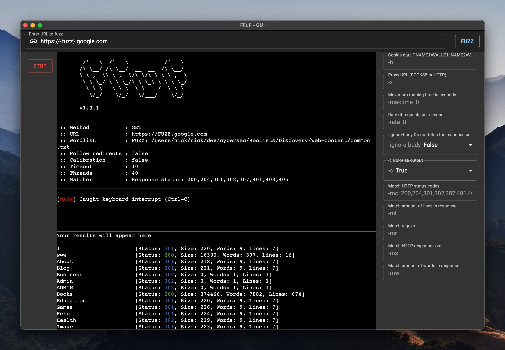

# FFuffer - A GUI fuzzing tool built on ffuff.

<br>

<p>
  ffuffer uses <a href="https://electron.atom.io/">Electron</a>, <a href="https://github.com/ffuf/ffuf">ffuf</a>.
</p>



## Install

Clone the repo and install dependencies:

```bash
git clone https://github.com/nitishxyz/ffuffer/
cd ffuffer
yarn
```

**You will need the [ffuf](https://github.com/ffuf/ffuf) intalled to use this GUI.**

## Starting Development

Start the app in the `dev` environment:

```bash
yarn start
```

## Packaging for Production

To package apps for the local platform:

```bash
yarn package
```
